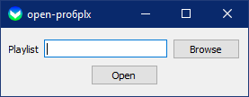
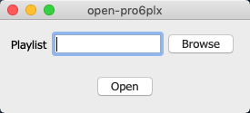

# open-pro6plx

A simple tool which copies the `selectedArrangementID` from songs to the playlist within a pro6plx file and opens it in
ProPresenter 6.

## How to use
There are multiple ways to use the tool.

1. Open a pro6plx file with open-pro6plx
2. Open it, drag a pro6plx file to the Text Box and click "Open"
3. Open it, browse a pro6plx file and click "Open"

The first way is the easiest and there is no additional action required to open it in ProPresenter.

## Get it
open-pro6plx ships as installer. See the [Releases](https://github.com/P1zz4br0etch3n/open-pro6plx/releases) section.
